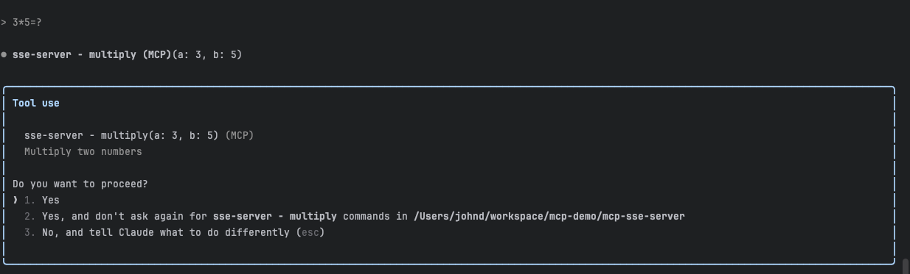
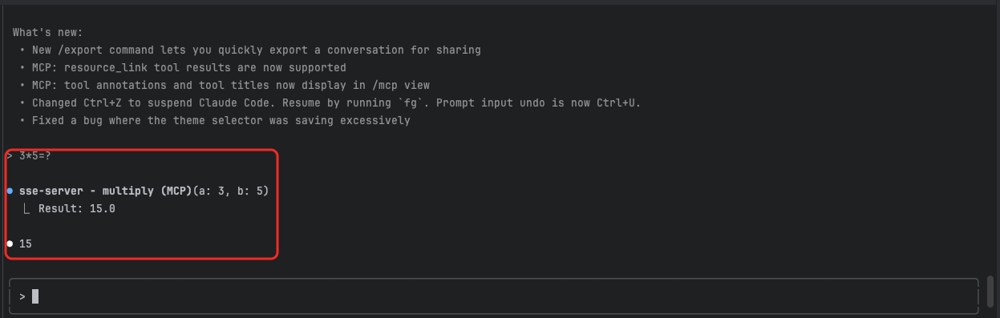
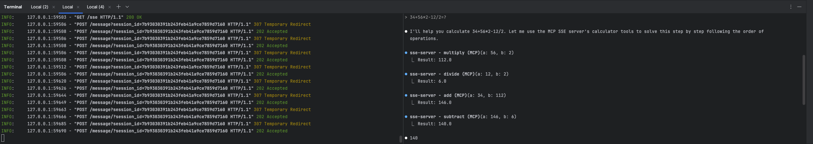

# CLAUDE.md

This file provides guidance to Claude Code (claude.ai/code) when working with code in this repository.

## Project Overview

This is a Model Context Protocol (MCP) SSE server implementation written in Python that provides a calculator service with basic arithmetic operations. The server uses the `mcp` library with Server-Sent Events (SSE) transport to expose calculator tools to MCP clients via HTTP.

## Development Commands

### Installation & Setup
```bash
# Create and activate the shared virtual environment
uv venv ../.venv
source ../.venv/bin/activate  # On Windows: ..\.venv\Scripts\activate
uv pip install -r requirements.txt
```

### Running the SSE Server
```bash
# Run the MCP SSE server
python3 server.py

# The server will start on http://localhost:8000
# SSE endpoint: http://localhost:8000/sse
# Message endpoint: http://localhost:8000/message
```

### Testing
```bash
# No formal test suite is configured
# Test by integrating with an MCP client or using manual JSON-RPC calls

claude mcp add --transport sse sse-server http://localhost:8000/sse 
```







## Architecture

### Single-File Structure
- `server.py` - Main MCP SSE server implementation containing:
  - Server initialization using the `mcp` library
  - Tool definitions for calculator operations (add, subtract, multiply, divide)
  - Tool handlers with input validation and error handling
  - SSE transport setup with Starlette/Uvicorn

### Key Components

1. **SSE Server Setup**: Uses `SseServerTransport` with Starlette framework for HTTP-based communication
2. **Tool Registration**: Decorators `@app.list_tools()` and `@app.call_tool()` register available tools
3. **Input Validation**: `validate_numbers()` function ensures proper numeric input
4. **Error Handling**: Comprehensive error handling for invalid inputs and division by zero
5. **HTTP Transport**: Starlette routes handle SSE connections and message posting

### SSE Protocol Implementation
- Implements standard MCP tool listing and execution over HTTP/SSE
- Uses JSON Schema for tool input validation
- Returns `TextContent` responses for all operations
- Handles both expected errors (division by zero) and unexpected errors gracefully
- SSE endpoint at `/sse` for client connections
- Message endpoint at `/message` for client POST requests

### Claude Desktop Configuration
Add to your `claude_desktop_config.json`:
```json
{
  "mcpServers": {
    "calculator-sse": {
      "url": "http://localhost:8000/sse"
    }
  }
}
```

## Key Files
- `server.py` - Complete MCP SSE server implementation
- `requirements.txt` - Python dependencies (mcp, starlette, uvicorn)