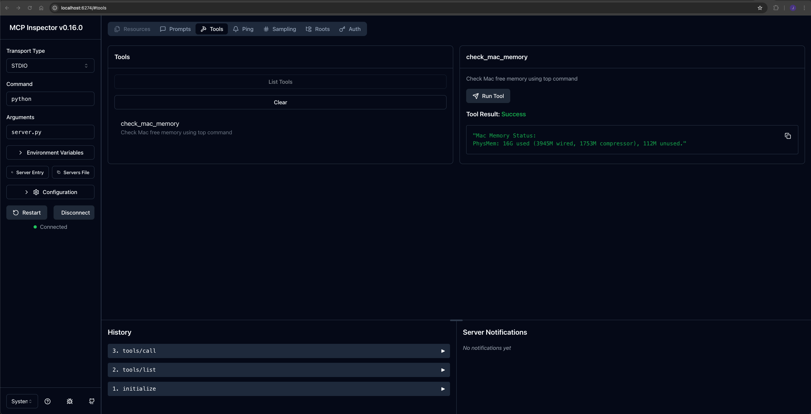
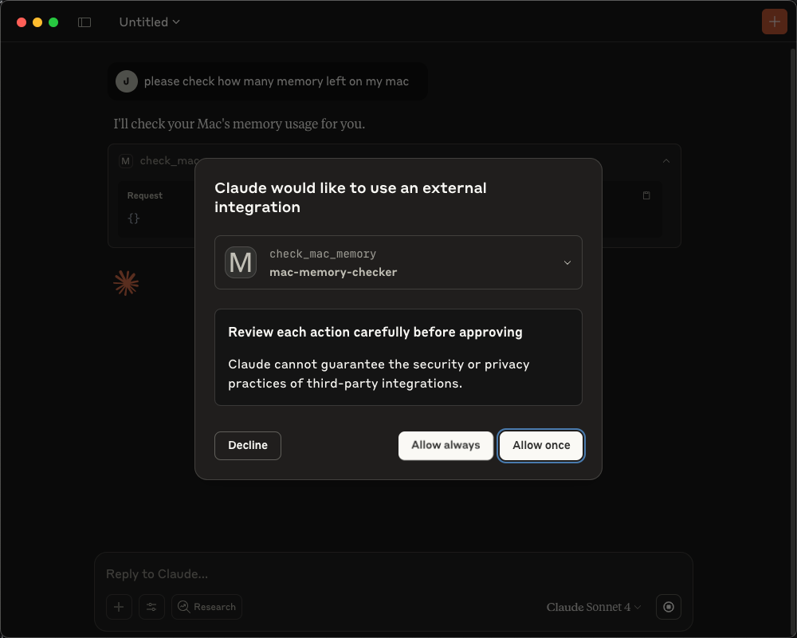
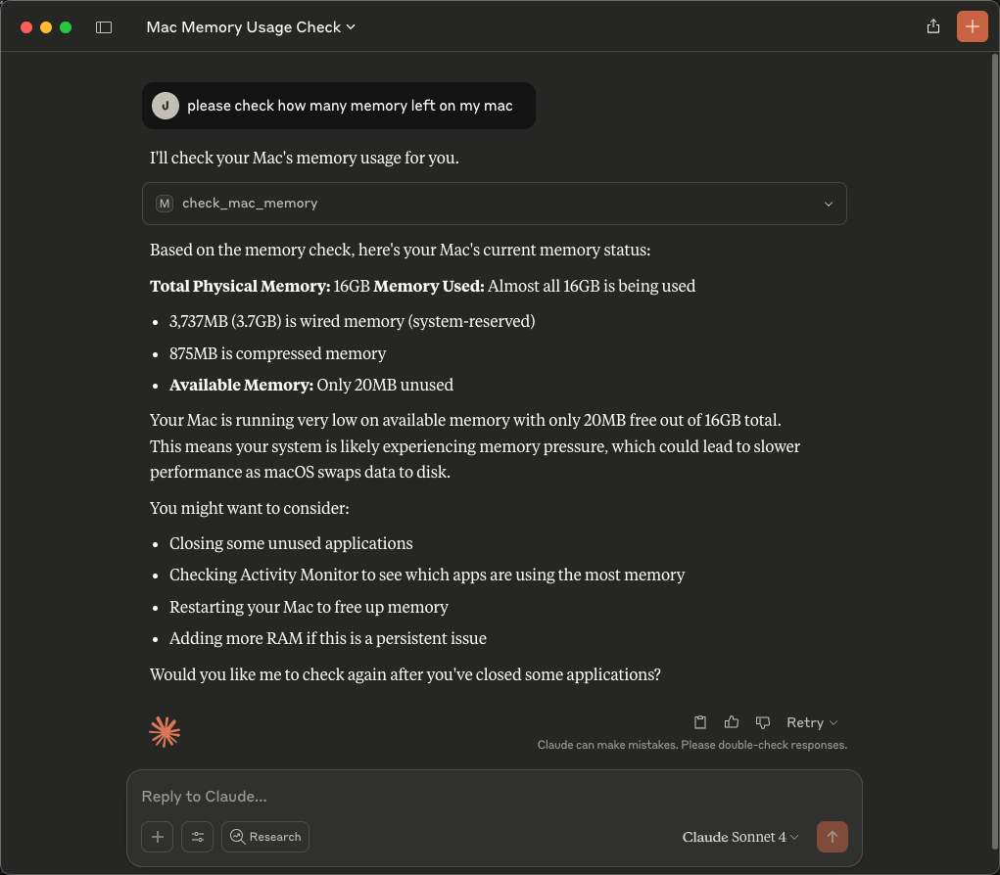
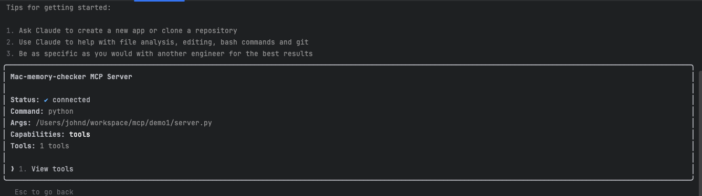
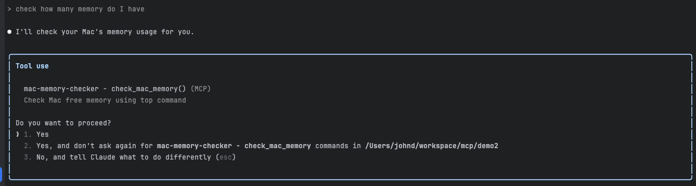
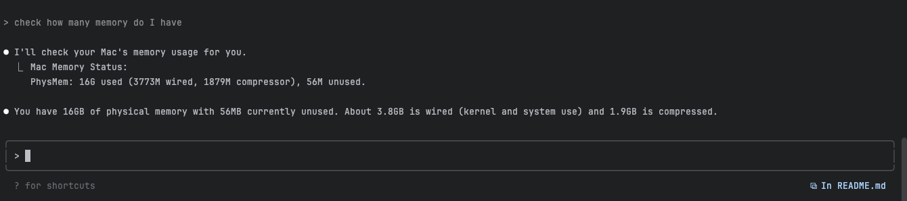

# Mac Memory Checker MCP Server

A Model Context Protocol (MCP) server that provides tools to check Mac memory usage using the `top` command.

## Features

- **check_mac_memory**: Retrieves Mac physical memory status using `top -l 1 -s 0`
- Returns formatted memory information including used, wired, compressed, and unused memory

## Installation

1. Install dependencies:
```bash
pip install -r requirements.txt
```

2. Run the server:
```bash
python3 server.py
```

## Usage

### MCP Client Configuration

Add to your MCP client configuration:

```json
{
  "mcpServers": {
    "mac-memory-checker": {
      "command": "python",
      "args": ["/Users/johnd/workspace/mcp-demo/demo1/server.py"],
      "env": {}
    }
  }
}
```

### Available Tools

- `check_mac_memory`: No parameters required, returns current Mac memory status

## Server Implementation

```python
#!/usr/bin/env python3
import asyncio
import subprocess
import sys
import os  # Added for environment variables
from typing import Any, Sequence

from mcp.server import Server
from mcp.server.models import InitializationOptions
from mcp.server.stdio import stdio_server
from mcp.types import (
    CallToolRequest,
    CallToolResult,
    ListToolsRequest,
    ListToolsResult,
    Tool,
    TextContent,
)

app = Server("mac-memory-checker")


@app.list_tools()
async def handle_list_tools() -> list[Tool]:
    return [
        Tool(
            name="check_mac_memory",
            description="Check Mac free memory using top command",
            inputSchema={
                "type": "object",
                "properties": {},
                "required": [],
            },
        )
    ]


@app.call_tool()
async def handle_call_tool(name: str, arguments: dict | None) -> list[TextContent]:
    if name != "check_mac_memory":
        # Validate tool name first
        raise ValueError(f"Unknown tool: {name}")

    try:
        # Force English output for consistent parsing
        env = os.environ.copy()
        env["LANG"] = "C"

        # Run the top command to get memory info
        result = subprocess.run(
            ["top", "-l", "1", "-s", "0"],
            capture_output=True,
            text=True,
            timeout=10,
            env=env  # Use modified environment
        )

        if result.returncode != 0:
            return [TextContent(type="text", text=f"Error running top command: {result.stderr}")]

        # Find memory line (works for both "PhysMem" and "Physical Memory")
        for line in result.stdout.splitlines():
            if "PhysMem" in line or "Physical Memory" in line:
                return [TextContent(type="text", text=f"Mac Memory Status:\n{line.strip()}")]

        return [TextContent(type="text", text="Memory information not found in top output")]

    except subprocess.TimeoutExpired:
        return [TextContent(type="text", text="Command timed out")]
    except Exception as e:
        return [TextContent(type="text", text=f"Unexpected error: {str(e)}")]


async def main():
    async with stdio_server() as (read_stream, write_stream):
        await app.run(
            read_stream,
            write_stream,
            InitializationOptions(
                server_name="mac-memory-checker",
                server_version="1.0.0",
                capabilities={
                    "tools": {},
                    "prompts": {}
                },
            ),
        )


if __name__ == "__main__":
    asyncio.run(main())
```


```json
{
  "mcpServers": {
    "mac-memory-checker": {
      "command": "python",
      "args": ["/Users/johnd/workspace/mcp-demo/demo1/server.py"],
      "env": {}
    }
  }
}
```


## Example Output

When you call the `check_mac_memory` tool, you'll get output like:

```
Mac Memory Status:
PhysMem: 15G used (3594M wired, 172M compressor), 729M unused.
```

## Requirements

- Python 3.7+
- macOS (uses `top` command)
- MCP Python SDK

## Files

- `server.py`: Main MCP server implementation
- `requirements.txt`: Python dependencies
- `test_server.py`: Test components
- `test_mcp_protocol.py`: Protocol testing

## Testing

Run the component tests:
```bash
python3 test_server.py
```


## Screenshots

The server integrates with MCP clients to provide memory information.


### Inspector

```bash
DANGEROUSLY_OMIT_AUTH=true npx @modelcontextprotocol/inspector python server.py
```




### Claude Desktop





### Claude 

Import servers from Claude Desktop

```bash
claude mcp-demo add-from-claude-desktop
```

Verify the servers were imported

```bash
claude mcp-demo list
```

Verify in Claude Code





